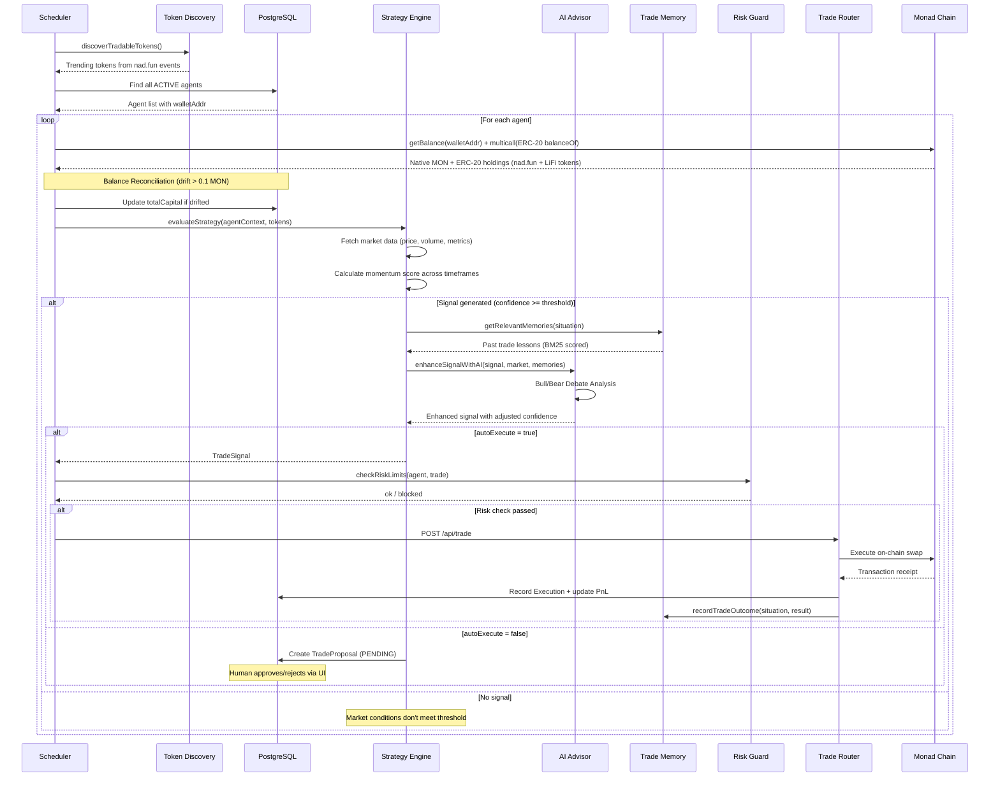
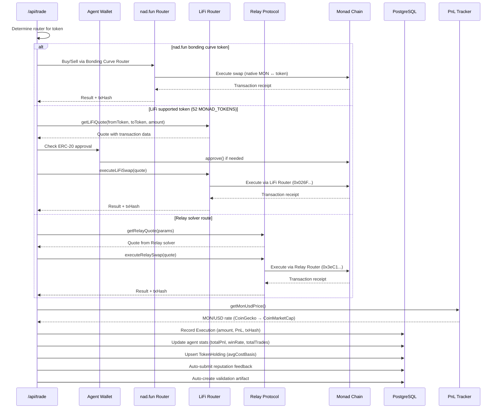
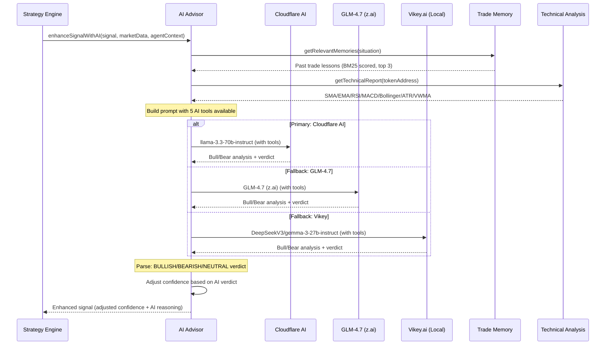
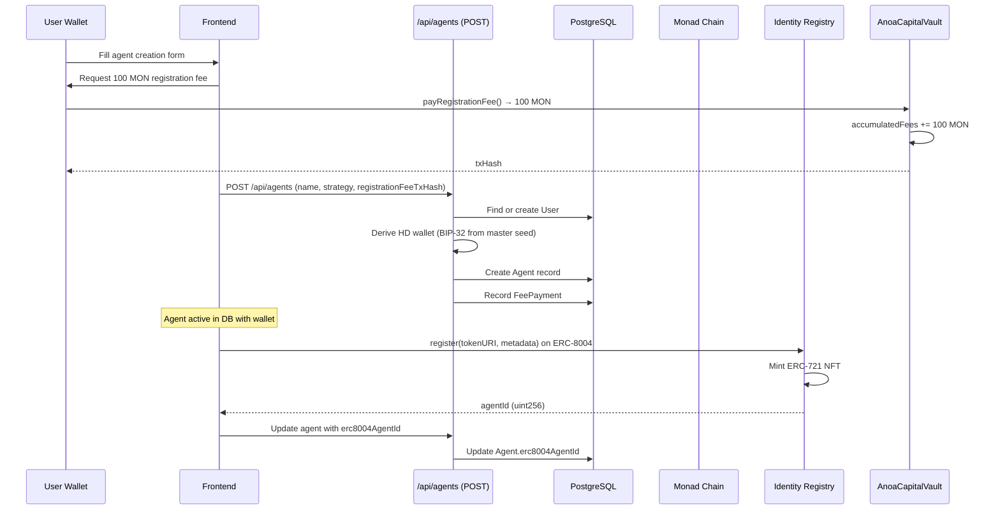
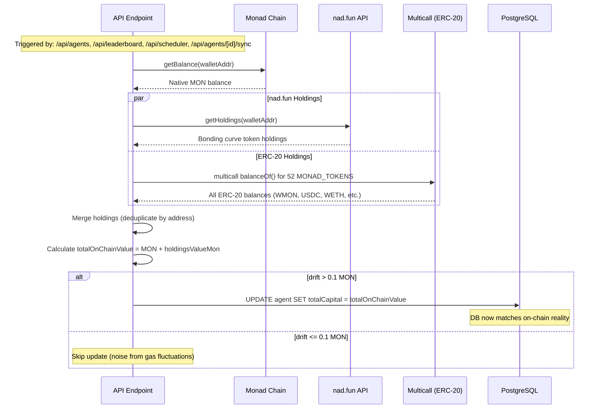

# ANOA Architecture: Proof-Anchored Intelligence for Autonomous Trading

> **Vision**: Deploy AI agents with verifiable on-chain execution, portable identity, and trustless capital delegation on Monad Network.

---

## Table of Contents

1. [System Overview](#system-overview)
2. [Core Architecture](#core-architecture)
3. [Sequence Diagrams](#sequence-diagrams)
4. [ERC-8004 Standard](#erc-8004-standard)
5. [AI Engine](#ai-engine)
6. [3-Router Trading Architecture](#3-router-trading-architecture)
7. [Strategy Engine](#strategy-engine)
8. [Smart Contracts](#smart-contracts)
9. [Protocol Integrations](#protocol-integrations)
10. [Database Schema](#database-schema)
11. [Chain Configuration](#chain-configuration)
12. [Implementation Status](#implementation-status)

---

## System Overview

```
┌───────────────────────────────────────────────────────────────────────┐
│                           ANOA Platform                               │
├───────────────────────────────────────────────────────────────────────┤
│                                                                       │
│  Frontend (Next.js 16 + React 19 + Tailwind CSS 4)                   │
│  ┌──────┬───────────┬────────┬─────────┬───────────┬──────────┐      │
│  │ Home │ Dashboard │ Agents │ Trading │ Portfolio │ Settings │      │
│  │      │ Leaderboard│ Create │ Terminal│ Yield     │          │      │
│  └──────┴───────────┴────────┴─────────┴───────────┴──────────┘      │
│                                                                       │
│  Protocol Layer                                                       │
│  ┌────────────┬─────────┬──────────────┬────────────────────┐        │
│  │ A2A        │ MCP     │ x402         │ EIP-712 Signatures │        │
│  │ JSON-RPC   │ 5 Tools │ Micropayments│ TradeIntent        │        │
│  └────────────┴─────────┴──────────────┴────────────────────┘        │
│                                                                       │
│  Backend (23+ API Routes, Prisma 6, PostgreSQL)                      │
│                                                                       │
│  AI Engine (3-Tier Orchestrated Fallback)                            │
│  ┌────────────────┬────────────┬───────────────────┐                 │
│  │ Cloudflare AI  │ GLM-4.7    │ Vikey          │                 │
│  │ llama-3.3-70b  │ z.ai     │ DeepseekV3/gemma-3-27b       │                 │
│  ├────────────────┴────────────┴───────────────────┤                 │
│  │ 5 AI Tools │ Trade Memory │ 7 Tech Indicators   │                 │
│  │            │ (BM25 Okapi) │ 3-Source OHLCV      │                 │
│  └──────────────────────────────────────────────────┘                 │
│                                                                       │
│  Blockchain (Monad Chain 143 + ERC-8004)                             │
│  ┌─────────────────────────────────────────────────────────┐         │
│  │ ERC-8004 Registries (Official Singleton on Monad)       │         │
│  │   Identity:   0x8004A169FB4a3325136EB29fA0ceB6D2e539a432│         │
│  │   Reputation: 0x8004BAa17C55a88189AE136b182e5fdA19dE9b63│         │
│  ├─────────────────────────────────────────────────────────┤         │
│  │ ANOA Custom: AnoaTrustlessAgentCore + AnoaCapitalVault  │         │
│  └─────────────────────────────────────────────────────────┘         │
│                                                                       │
│  DeFi Integration (3-Router + 2 Yield)                               │
│  ┌──────────┬──────────┬──────────┬──────────┬──────────┐            │
│  │ nad.fun  │ LiFi     │ Relay    │ aPriori  │ Upshift  │            │
│  │ Bonding  │ 52 Tokens│ Solver   │ aprMON   │ earnAUSD │            │
│  │ Curve    │ DEX Agg  │ Protocol │ Staking  │ Vault    │            │
│  └──────────┴──────────┴──────────┴──────────┴──────────┘            │
│                                                                       │
└───────────────────────────────────────────────────────────────────────┘
```

---

## Core Architecture

### Data Flow

```
User/Scheduler → API Route → Strategy Engine → AI Advisor → Trade Execution → PnL Tracker → DB Update
                                    ↓                ↓               ↓
                              Trade Memory    Bull/Bear Debate   3-Router Selection
                              (BM25 Okapi)   (Market Analyst +   (nad.fun/LiFi/Relay)
                                              Risk Manager)
```

### Key Architectural Decisions

| Decision | Rationale |
|----------|-----------|
| **Official ERC-8004 Registries** | Use Monad singleton registries (not custom) for cross-platform agent discovery |
| **3-Tier AI Fallback** | Cloudflare (free tier) → GLM-4.7 → DeepSeekV3/Gemma-3 ensures AI never fails |
| **HD Wallet (BIP-32)** | Each agent gets isolated wallet derived from master seed |
| **3-Router Trading** | nad.fun bonding curve → LiFi DEX aggregator → Relay solver |
| **Human-in-the-Loop** | TradeProposals allow manual approval before execution |
| **Balance Reconciliation** | On-chain balance synced to DB on every API call (drift > 0.1 MON) |

---

## Sequence Diagrams

### 1. Autonomous Trading Loop (Scheduler)



### 2. Trade Execution (3-Router Selection)



### 3. AI Advisor Decision Process



### 4. Agent Registration & ERC-8004



### 5. Balance Reconciliation Flow



---

## ERC-8004 Standard

### Three Core Registries

| Registry | Address | Purpose |
|----------|---------|---------|
| **Identity** | `0x8004A169FB4a3325136EB29fA0ceB6D2e539a432` | Portable ERC-721 agent identifiers |
| **Reputation** | `0x8004BAa17C55a88189AE136b182e5fdA19dE9b63` | Feedback scores (0-100) with tags |
| **Validation** | Coming Soon | Independent verification hooks |

### Trust Models

| Model | Description |
|-------|-------------|
| **Reputation-based** | Client feedback scores (0-100) aggregated on-chain |
| **Crypto-economic** | Stake-secured validation with economic incentives |
| **Crypto-verification** | TEE attestations and zkML proofs |

### Identity Registry Functions

```solidity
function register(string calldata tokenURI, MetadataEntry[] calldata metadata)
    external returns (uint256 agentId);

function setMetadata(uint256 agentId, string calldata key, bytes calldata value) external;
function getMetadata(uint256 agentId, string calldata key) external view returns (bytes memory);
function tokenURI(uint256 tokenId) external view returns (string memory);
function ownerOf(uint256 tokenId) external view returns (address);
```

### Reputation Registry Functions

```solidity
function giveFeedback(
    uint256 agentId, uint8 score, bytes32 tag1, bytes32 tag2,
    string calldata fileuri, bytes32 filehash, bytes calldata feedbackAuth
) external;

function getSummary(
    uint256 agentId, address[] calldata clientAddresses, bytes32 tag1, bytes32 tag2
) external view returns (uint64 count, uint8 averageScore);
```

### Agent Card Schema

```json
{
  "type": "https://eips.ethereum.org/EIPS/eip-8004#registration-v1",
  "name": "myAgent",
  "description": "Autonomous trading agent",
  "image": "https://r2.example/agent-42.png",
  "endpoints": [
    { "name": "A2A", "endpoint": "https://agent.example/a2a", "version": "0.3.0" },
    { "name": "MCP", "endpoint": "https://agent.example/mcp", "version": "2025-06-18" }
  ],
  "supportedTrust": ["reputation", "crypto-economic"]
}
```

---

## AI Engine

### 3-Tier Orchestrated Fallback

| Priority | Provider | Model | Features |
|----------|----------|-------|----------|
| Primary | Cloudflare AI | `@cf/meta/llama-3.3-70b-instruct-fp8-fast` | Free 10k neurons/day, function calling |
| Secondary | GLM-4.7 (z.ai) | `glm-4.7` | Advanced reasoning, function calling |
| Tertiary | Vikey.ai | `DeepSeekV3/gemma-3-27b-instruct` | Backup with tools |

### 5 AI Tools Available

| Tool | Description |
|------|-------------|
| `get_bonding_curve_status` | Query on-chain bonding curve progress, graduation status |
| `get_token_market_data` | Price, volume, holders, market cap from nad.fun |
| `check_risk_assessment` | Validate trade against risk limits |
| `get_price_quote` | Get execution quote from LiFi or nad.fun |
| `get_technical_analysis` | Full technical indicators report (7 indicators) |

### Bull/Bear Debate Pattern

Inspired by TradingAgents framework:


1. Strategy engine produces math-based TradeSignal
2. AI receives: signal + market data + portfolio state + past trade memories
3. AI runs bull/bear case analysis in structured prompt
4. BULLISH case: reasons to proceed
5. BEARISH case: reasons to avoid
6. VERDICT: BULLISH / BEARISH / NEUTRAL with confidence adjustment
7. If AI disagrees with signal → confidence reduced or signal rejected


### Trade Memory (BM25 Okapi)

- **Storage**: Prisma Execution records (situation + result + lesson)
- **Retrieval**: BM25 scoring with k1=1.5, b=0.75
- **Recency bias**: Recent trades weighted higher
- **Mistake amplification**: Losing trades weighted 2x in retrieval
- **Pure TypeScript** — no external NLP dependencies

### Technical Indicators (7)

All computed from OHLCV candle data (pure TypeScript):

| Indicator | Parameters | Signal |
|-----------|------------|--------|
| SMA | 10, 50 period | Trend direction |
| EMA | 10 period | Responsive trend |
| RSI | 14 period | Overbought/oversold |
| MACD | 12/26/9 | Momentum crossover |
| Bollinger Bands | 20 period, 2 std dev | Volatility squeeze |
| ATR | 14 period | Volatility measurement |
| VWMA | 20 period | Volume-weighted trend |

### Chart Aggregator (3-Source OHLCV)

| Priority | Source | Coverage |
|----------|--------|----------|
| 1 | nad.fun API | Bonding curve tokens |
| 2 | DexScreener | Any token with DEX liquidity |
| 3 | GeckoTerminal | Broad Monad DEX coverage |

Cache: 3-minute TTL, 100 max entries.

---

## 3-Router Trading Architecture

### Router Selection Logic

```
Token received for trade
    │
    ├─ Is nad.fun bonding curve token? ──────────── Yes ──→ nad.fun Router
    │   (not graduated, has bonding curve)                   (Bonding Curve Router)
    │
    ├─ Is in MONAD_TOKENS (52 tokens)? ─────────── Yes ──→ LiFi Router
    │   (WMON, USDC, WETH, WBTC, APRMON, etc.)             (0x026F2520...)
    │
    └─ Relay available? ─────────────────────────── Yes ──→ Relay Protocol
        (solver-based, may find better price)                (0x3eC130B6...)
```

### Contract Addresses (Mainnet)

| Router | Address | Purpose |
|--------|---------|---------|
| **nad.fun Bonding Curve** | `0x6F6B8F1a20703309951a5127c45B49b1CD981A22` | Buy/sell bonding curve tokens |
| **nad.fun DEX** | `0x0B79d71AE99528D1dB24A4148b5f4F865cc2b137` | Graduated token trading |
| **nad.fun LENS** | `0x7e78A8DE94f21804F7a17F4E8BF9EC2c872187ea` | Price quotes + curve data |
| **LiFi** | `0x026F252016A7C47CDEf1F05a3Fc9E20C92a49C37` | DEX aggregator (52 tokens) |
| **Relay** | `0x3eC130B627944cad9b2750300ECB0A695DA522B6` | Solver-based routing |
| **Relay Approval** | `0x58cC3e0aA6CD7bf795832A225179ec2d848cE3e7` | ERC-20 approval proxy |

### Supported Tokens (LiFi — 52 tokens)

Categories: Native & Wrapped (MON, WMON), Stablecoins (USDC, USDT0, AUSD, IDRX, USD*, USD1), Yield Stablecoins (earnAUSD, sAUSD, suUSD, etc.), ETH Variants (WETH, wstETH, weETH, ezETH, pufETH, suETH), BTC Variants (WBTC, BTC.B, LBTC, solvBTC, xSolvBTC, suBTC), MON Staking/LST (aprMON, gMON, sMON, shMON, earnMON, lvMON, mcMON), Cross-chain (SOL, XAUT0), DeFi Protocol Tokens (CAKE, DUST, EUL, etc.), Custom (CHOG, APR).

Full list: `src/lib/lifi-client.ts` → `MONAD_TOKENS`

### ERC-20 Holdings Query

The `getERC20Holdings()` function in `lifi-client.ts` uses `multicall` to batch query `balanceOf()` for all 52 MONAD_TOKENS in 1-2 RPC calls. This supplements nad.fun's `getHoldings()` which only returns bonding curve tokens.

- WMON and MON LSTs (aprMON, gMON, etc.) → value ≈ balance (1:1 with MON)
- Other tokens → value requires price oracle

---

## Strategy Engine

### 6 Strategy Types

| Strategy | Risk Levels | Key Logic |
|----------|-------------|-----------|
| **MOMENTUM** | low, medium, high | Multi-timeframe momentum scoring (5m + 1h + 4h) |
| **YIELD** | low, medium, high | aPriori staking (aprMON) + Upshift vault (earnAUSD) |
| **ARBITRAGE** | low, medium, high | Cross-venue price comparison (nad.fun vs LiFi vs Relay) |
| **DCA** | low, medium, high | Systematic accumulation at intervals |
| **GRID** | low, medium, high | Range-bound buy/sell grid |
| **HEDGE** | low, medium, high | Capital protection strategies |

### Risk Parameters

| Parameter | Low | Medium | High |
|-----------|-----|--------|------|
| `maxPositionPct` | 5% | 10% | 20% |
| `minConfidence` | 75 | 60 | 45 |
| `maxDrawdownLimit` | 10% | 20% | 35% |
| `GAS_RESERVE_MON` | 5.0 | 3.0 | 1.0 |

### Evaluation Flow

1. Fetch market data for token pool (price, volume, metrics, bonding curve status)
2. Calculate momentum score across timeframes
3. Apply anti-sniping filter (skip tokens < 5 blocks old)
4. Apply bonding curve intelligence (avoid near-graduation tokens)
5. Check if signal meets confidence threshold for risk level
6. If signal: enhance with AI advisor + trade memory
7. Output: TradeSignal or null

---

## Smart Contracts

### Architecture Decision

**We use the official Monad ERC-8004 singleton registries**, not custom deployments. This ensures cross-platform agent discovery and unified reputation.

### ANOA Custom Contracts (`/contracts/src/`)

| Contract | Purpose | Key Functions |
|----------|---------|---------------|
| **AnoaTrustlessAgentCore** | Trade execution, EIP-712 signed intents, PnL tracking | `executeBuy()`, `executeSell()`, `setProtocolFee()` |
| **AnoaCapitalVault** | Capital delegation, fund release/return, PnL recording, fee management | `delegateCapital()`, `releaseFundsToAgent()`, `returnFundsFromAgent()`, `withdrawCapital()`, `batchRecordPnl()`, `setAgentWallet()`, `withdrawFees()` |
| **AnoaAgentIdentity** | Reference ERC-721 identity (not deployed; official used) | `register()`, `setMetadata()`, `setOperator()` |
| **AnoaAgentReputation** | Reference reputation with validator weighting | `giveFeedback()`, `getTrustScore()`, `hasMinimumReputation()` |
| **AnoaAgentValidator** | Validation schemes (BASIC/STANDARD/ADVANCED) | `validateAgent()`, `registerValidator()`, `slashValidator()` |

### Capital Flow Architecture (Flow-Through Model)

```
┌─────────────────────────────────────────────────────────────────┐
│                     AnoaCapitalVault                             │
│               0x3ebB151F9D743D6122B07B49592f8C22b77F5109        │
├─────────────────────────────────────────────────────────────────┤
│                                                                  │
│  User ─────▶ payRegistrationFee() ─────▶ accumulatedFees        │
│                  [100 MON]               (platform revenue)      │
│                                               │                  │
│                                          withdrawFees()          │
│                                               ▼                  │
│                                          Treasury                │
│                                                                  │
│  User ─────▶ delegateCapital(agentId) ─▶ agentCapital[agentId] │
│              [min 1000 MON]                    │                  │
│                                                │                  │
│              Operator ─▶ setAgentWallet(agentId, hdWallet)       │
│              Operator ─▶ releaseFundsToAgent(agentId, amount)    │
│                                    │                              │
│                                    ▼                              │
│                            Agent HD Wallet                        │
│                        (trades with own + delegated)              │
│                                    │                              │
│              Agent Wallet ─▶ returnFundsFromAgent(agentId)       │
│                                    │                              │
│                                    ▼                              │
│              User ─────▶ withdrawCapital(delegationId)           │
│                          principal +/- PnL                        │
│                          - 20% performance fee (profit only)      │
│                          - 0.5% withdrawal fee                    │
│                                    │                              │
│                                    ▼                              │
│                          User wallet (any address)                │
│                                                                  │
│  Operator ─▶ batchRecordPnl(ids[], amounts[])                   │
│              (record per-delegation PnL on-chain)                │
│                                                                  │
└─────────────────────────────────────────────────────────────────┘
```

**Key Design**: Vault does NOT hold large balances. Delegated MON flows to agent wallet via `releaseFundsToAgent()`. Vault only stores platform fees.

### Fee Configuration (All Configurable)

```solidity
// AnoaCapitalVault — All fees start at 0, configure via owner
vault.updateFeeConfig(
    100 ether,   // registrationFee — 100 MON
    50,          // tradingFeeBps — 0.5%
    10,          // withdrawalFeeBps — 0.1%
    100 ether    // minCapital — 100 MON
);

// AnoaTrustlessAgentCore — Protocol fee configurable
core.setProtocolFee(30); // 0.3%
```

### TradeIntent (EIP-712)

```typescript
const TRADE_INTENT_TYPE = {
  TradeIntent: [
    { name: 'agentId', type: 'uint256' },
    { name: 'action', type: 'string' },      // "buy" | "sell"
    { name: 'token', type: 'address' },
    { name: 'amount', type: 'uint256' },
    { name: 'maxSlippage', type: 'uint256' },
    { name: 'deadline', type: 'uint256' },
    { name: 'nonce', type: 'uint256' }
  ]
};
```

### 4. Smart Contract Deployment (Optional)
> Note: Deployment contract is optional if ownable

```diff
+ No. 1 == Install Development Tools ==
curl -L https://foundry.paradigm.xyz | bash
source ~/.bashrc
foundryup

+ No.2 == Install Development Tools ==
forge install OpenZeppelin/openzeppelin-contracts
forge install foundry-rs/forge-std

+ No.3 == Compile Contracts ==
cd contracts && forge build

# Deploy to Monad Mainnet
forge script script/DeployAnoa.s.sol:DeployAnoa \
  --rpc-url https://rpc3.monad.xyz \
  --broadcast --verify

# Run tests
forge test -vv
```

---

## Protocol Integrations

### A2A Protocol (Agent-to-Agent)

- **Endpoint**: `POST /api/a2a`
- **Discovery**: `GET /api/a2a` (Agent Card)
- **Protocol**: JSON-RPC 2.0
- **Payment**: x402 protected ($0.001 USDC per call)
- **7 Methods**: tasks/send, tasks/get, tasks/cancel, tasks/list, tasks/pushNotification/set, tasks/pushNotification/get, agent/authenticatedExtendedCard

### MCP Protocol (Model Context Protocol)

- **Endpoint**: `POST /api/mcp` (tool execution), `GET /api/mcp` (tool listing)
- **5 Tools**: get_quote, execute_trade, get_agent_reputation, chat, get_market_data
- **SDK**: `@modelcontextprotocol/sdk`

### x402 Payment Protocol

| Config | Value |
|--------|-------|
| **Facilitator** | `https://x402-facilitator.molandak.org` |
| **Network (Mainnet)** | `eip155:143` |
| **Network (Testnet)** | `eip155:10143` |
| **USDC (Mainnet)** | `0x754704Bc059F8C67012fEd69BC8A327a5aafb603` |
| **Protected Routes** | `POST /api/a2a`, `POST /api/trade` ($0.001 USDC each) |
| **Conditional** | Disabled if `PAY_TO_ADDRESS` env var not set |

### Yield Protocols

| Protocol | Contract | Type |
|----------|----------|------|
| **aPriori** | `0x0c65A0BC65a5D819235B71F554D210D3F80E0852` | Liquid staking (MON → aprMON) |
| **Upshift** | `0x36eDbF0C834591BFdfCaC0Ef9605528c75c406aA` | Vault (aUSD → earnAUSD) |

---

## Database Schema

### 12 Prisma Models

| Model | Purpose | Key Fields |
|-------|---------|------------|
| **User** | Wallet addresses | address, ensName |
| **Agent** | AI trading agents | strategy, trustScore, totalCapital, totalPnl, walletAddr, erc8004AgentId |
| **Execution** | Trade records | type (BUY/SELL/STAKE/etc.), amount, pnlUsd, txHash, status |
| **Delegation** | Capital delegations | amount, lockupEnd, status |
| **TradeProposal** | Human-in-the-loop | action, confidence, status (PENDING/APPROVED/REJECTED/EXECUTED) |
| **Validation** | ERC-8004 validations | schemeId, result, attestation |
| **Feedback** | Reputation feedback | score (0-100), tags, txHash |
| **ApiKey** | User API keys | key, permissions |
| **TokenHolding** | Portfolio tracking | tokenAddress, balance, avgCostBasis |
| **YieldDeposit** | Yield deposits | protocol (APRIORI/UPSHIFT), amount, shares |
| **YieldWithdrawal** | Yield withdrawals | action, status, claimableAt |
| **FeePayment** | Platform fees | feeType (REGISTRATION), amount, txHash |

### Key Enums

- **Strategy**: MOMENTUM, YIELD, ARBITRAGE, DCA, GRID, HEDGE
- **AgentStatus**: PENDING, ACTIVE, PAUSED, STOPPED
- **ExecutionType**: BUY, SELL, PROVIDE_LIQUIDITY, REMOVE_LIQUIDITY, LEND, BORROW, REPAY, STAKE, UNSTAKE, CLAIM_REWARDS
- **TradeProposalStatus**: PENDING, APPROVED, REJECTED, EXECUTED, EXPIRED

---

## Chain Configuration

### Supported Networks

| Chain | Chain ID | RPC | Block Time |
|-------|----------|-----|-----------|
| **Monad Mainnet** | 143 | `https://rpc3.monad.xyz` | 400ms |
| **Monad Testnet** | 10143 | `https://testnet-rpc.monad.xyz` | 400ms |

### Contract Addresses

**ERC-8004 Registries** (same on testnet + mainnet):
- Identity: `0x8004A169FB4a3325136EB29fA0ceB6D2e539a432`
- Reputation: `0x8004BAa17C55a88189AE136b182e5fdA19dE9b63`

**ANOA Contracts (Mainnet)**:
- AnoaTrustlessAgentCore: `0x3379806C54B0805EC01568e00547f164b56A5Eb8`
- AnoaCapitalVault: `0x3ebB151F9D743D6122B07B49592f8C22b77F5109`

**nad.fun DEX (Mainnet)**:
- LENS: `0x7e78A8DE94f21804F7a17F4E8BF9EC2c872187ea`
- Bonding Curve Router: `0x6F6B8F1a20703309951a5127c45B49b1CD981A22`
- DEX Router: `0x0B79d71AE99528D1dB24A4148b5f4F865cc2b137`

**LiFi (Mainnet)**: `0x026F252016A7C47CDEf1F05a3Fc9E20C92a49C37`

**Relay (Mainnet)**:
- Router: `0x3eC130B627944cad9b2750300ECB0A695DA522B6`
- Approval Proxy: `0x58cC3e0aA6CD7bf795832A225179ec2d848cE3e7`
- Receiver: `0xf17902d51FdfF7Bf50AacB78d6bB399BaF88b479`

**Yield (Mainnet)**:
- aPriori (aprMON): `0x0c65A0BC65a5D819235B71F554D210D3F80E0852`
- Upshift Vault: `0x36eDbF0C834591BFdfCaC0Ef9605528c75c406aA`

### External APIs

| API | Purpose | Rate Limit |
|-----|---------|------------|
| nad.fun | Market data, charts, holdings | 10/min (free), 100/min (with key) |
| LiFi | DEX quotes + swaps | No published limit |
| Relay | Solver quotes + swaps | 50 quotes/min (free), 10/sec (with key) |
| CoinGecko | MON/USD price | Standard tier |
| CoinMarketCap | Fallback MON/USD price | Standard tier |
| DexScreener | OHLCV chart data | Standard tier |
| GeckoTerminal | OHLCV chart data | Standard tier |

---

## Implementation Status

### Completed

- [x] ERC-8004 Identity + Reputation integration
- [x] 6 trading strategies with market data evaluation
- [x] 3-tier AI advisor (Cloudflare → GLM-4.7 → Vikey) with 5 tools
- [x] 3-router trading (nad.fun + LiFi 52 tokens + Relay Protocol)
- [x] Trade Memory (BM25 Okapi) for learning from past trades
- [x] Technical indicators (SMA/EMA/RSI/MACD/Bollinger/ATR/VWMA)
- [x] Chart aggregator (nad.fun → DexScreener → GeckoTerminal)
- [x] Autonomous scheduler with token discovery + auto-execute
- [x] Human-in-the-loop trade proposals (OpenClaw Judgement)
- [x] Balance reconciliation (on-chain → DB sync, nad.fun + ERC-20)
- [x] HD wallet derivation (BIP-32 from master seed)
- [x] PnL tracking in USD (CoinGecko + CoinMarketCap)
- [x] Risk guard (daily loss limit, max trades, drawdown)
- [x] Yield protocols (aPriori staking + Upshift vault)
- [x] A2A protocol (JSON-RPC 2.0, 7 methods)
- [x] MCP protocol (5 tools)
- [x] x402 micropayments on A2A + Trade
- [x] Auto-feedback + auto-validation after trade
- [x] Portfolio tracking with transactions (Etherscan API v2)
- [x] 23+ API routes, 12 Prisma models, 9 frontend pages
- [x] Deploy AnoaTrustlessAgentCore + AnoaCapitalVault to Monad Mainnet
- [x] Capital flow-through model (releaseFundsToAgent, returnFundsFromAgent)
- [x] Per-entry PnL distribution for delegators
- [x] Dashboard delegation notification per agent

### Pending

- [ ] Convert ANOA contracts to upgradeable proxy
- [ ] IPFS upload for agent metadata
- [ ] Multi-agent swarm orchestration
- [ ] Uniswap V3 AMM integration

---

## References

- [EIP-8004 Specification](https://eips.ethereum.org/EIPS/eip-8004)
- [A2A Protocol](https://a2a-protocol.org/latest/specification/)
- [MCP Protocol](https://modelcontextprotocol.io/)
- [x402 Payment Protocol](https://www.npmjs.com/package/@x402/core)
- [Monad Network](https://monad.xyz)
- [LiFi Protocol](https://li.fi)
- [Relay Protocol](https://relay.link)
- [nad.fun Documentation](https://docs.nad.fun)

---

*Last Updated: February 2026*
